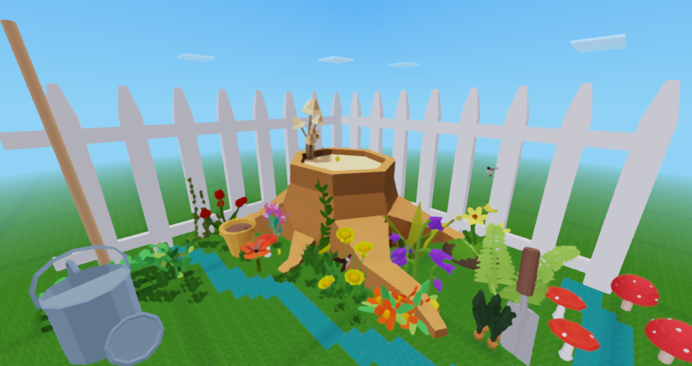

# LittleLady

A Little Ladybug in a Big World

# This is a Minetest GAME JAM 2021 Submission

Which means not everything is perfect:

> The first time you start a new world, the game will "ERROR" out. This is normal, and required for proper setup. Just start it again :)

-----------------------------------
See mod licenses for everything license related. 

Generally: 
- All source code is MIT licensed, except moreblocks which is zlib licensed (more open). 
- All assets are at least CC-BY-SA or more open like MIT. Take a look at individual mod folder Licenses. 

